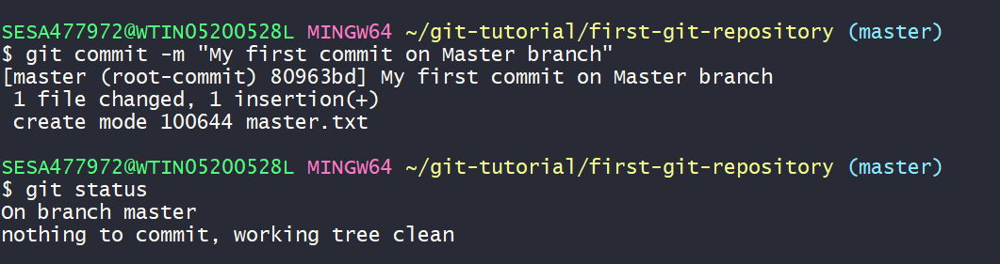
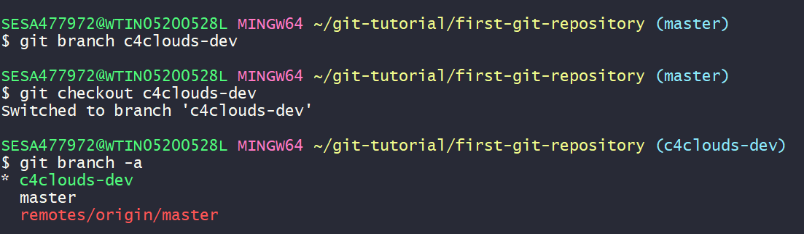
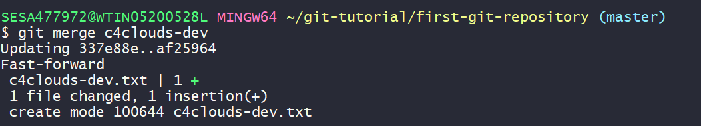
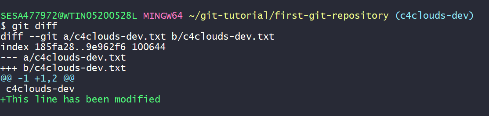
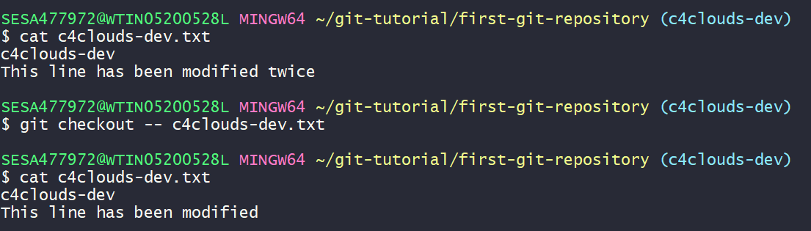
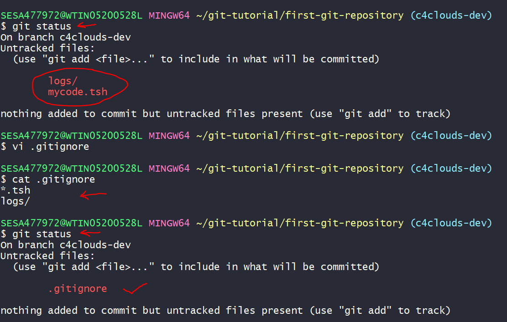

### In this Tutorial we are going to learn
  * Install Git Bash/Client
  * Configure the Client 
  * Configure the Repository locally 
  * Some Git Commands
  * Create Free GitHub Account
  * Push the local repository to GitHub

## Installing GitBash
[Click Here to Download the GitBash for Windows](https://git-scm.com/download/win)

Once you download please Install with the default settings.

To Verify the installation 


## To configure the client for the first time we need to specify the UserName and the UserMailID 
```
git config --global user.name "subrat" #UserName must be in doublequotes. 
git config --global user.email subrat@c4clouds.com
```

To Verify the global config
```
git config --list
```


## Configure the Repository locally
Inorder to work with multiple repository let's create a base directory i.e. git-tutorial
In you GitBash window execute the below command

```bash
mkdir git-tutorial
cd git-tutorial
mkdir first-git-repository
```
### To Initial the Repository
```
git init 
```


Note: After initialize you can sea a hidden folder/directory i.e .git and you can see a default branch i.e master


```diff
- Warning: Don't modify any file else your repository will go for a toss 
```
## Some Git Commands
```bash
echo "My First file on Master branch" > master.txt

git status
```


Note: The file is highlighted with red colour because the file is not trackable by git.
Inorder to track by git we have to add the file(s) to git.

```bash
git add file1.txt file2.txt

#To add all the files in the directory
git add .

git status 
```


To commit your changes. 

```bash
git commit -m "My first commit on Master branch"

#To See the Status

git status
```


To view the log(s)

```bash
git log
```

<image src="images/git-log.PNG">

## Create Free GitHub Account

[Click Here to Navigate to github.md](https://github.com/submah/git-tutorial/blob/master/github.md)

### To Create a Branch 
```code
git branch c4clouds-dev
```

### To Checkout to a Branch
```code
git checkout c4clouds-dev
```

### To see lists of Branch
```code
git branch -a
```



### To merge c4clouds-dev to master branch
>**Note: Before merging anything to master make sure you are in master branch**

```code
git diff msaster..branch-name # To view the difference between master branch and the other branch
git merge c4clouds-dev
```



### To view the modification on a file 
```code
#Modify an existing file
git diff
```



### To Remove a file
```code
git rm filename.txt
```


### To undo a change which not been publidhed to stage area
```code
git checkout -- filename.txt
```


### To undo a change(s) in stage area
```code
git diff --staged
git reset HEAD filename
git status
git checkout -- filename
```

### Restore from an earlier commit
```code
git log -- filename-that-to-be-restored
git checkout commit-id -- filename
git status
git commit 
```
## Working with .gitignore
```code
touch mycode.tsh
mkdir logs
touch logs/a.log
touch logs/b.log
git status

Note: git status will show both the mycode.sh and logs directory. If you want that git shuldn't pay attention to the logs then you have to creat a directory i.e. .gitignore

vi .gitignore #copy and paste the below lines to the file.
*.tsh
logs/
#==========
git status
```


### To Delete a branch
```code
#Before delete any branch first check whether it's merged with master branch or not.
git branch --merged

#To Delete branch
git branch -d branchname
```


