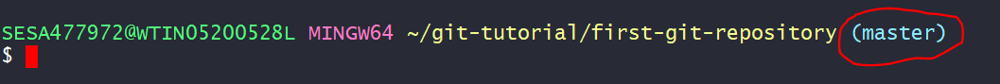
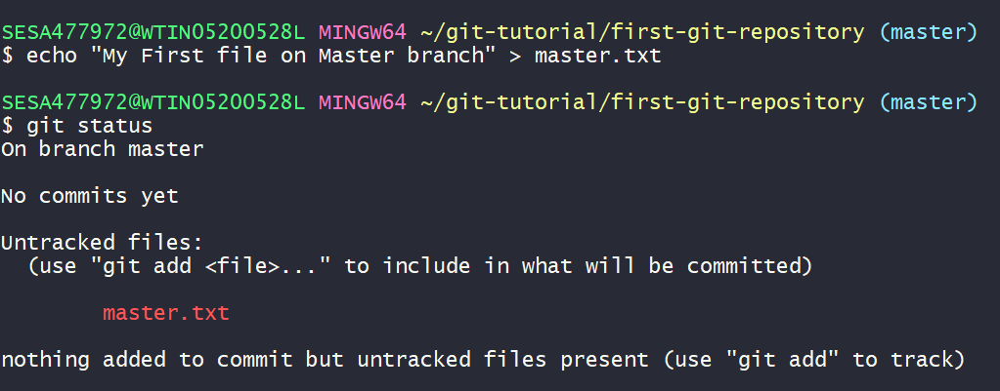
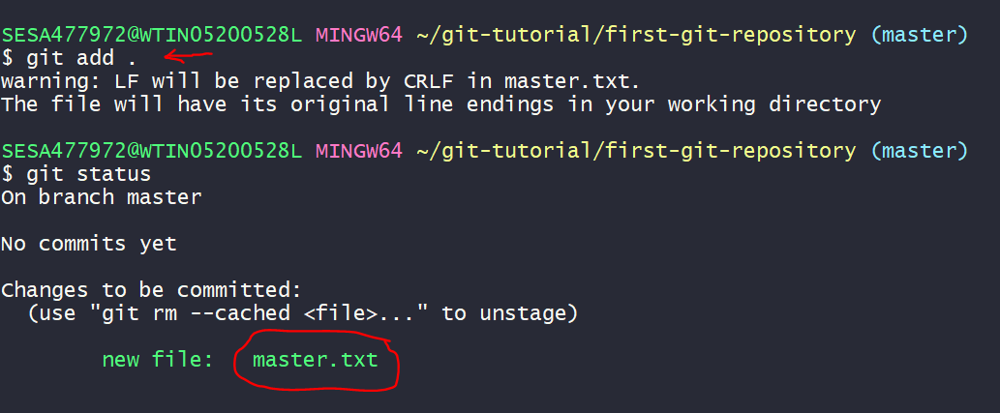

### In this Tutorial we are going to learn
  * Install Git Bash/Client
  * Configure the Client 
  * Configure the Repository locally 
  * Some Git Commands
  * Create Free GitHub Account
  * Push the local repository to GitHub

## Installing GitBash
[Click Here to Download the GitBash for Windows](https://git-scm.com/download/win)

Once you download please Install with the default settings.

To Verify the installation 


## To configure the client for the first time we need to specify the UserName and the UserMailID 
```
git config --global user.name "subrat" #UserName must be in doublequotes. 
git config --global user.email subrat@c4clouds.com
```

To Verify the global config
```
git config --list
```


## Configure the Repository locally
Inorder to work with multiple repository let's create a base directory i.e. git-tutorial
In you GitBash window execute the below command

```bash
mkdir git-tutorial
cd git-tutorial
mkdir first-git-repository
```
### To Initial the Repository
```
git init 
```


Note: After initialize you can sea a hidden folder/directory i.e .git and you can see a default branch i.e master



```diff
- Warning: Don't modify any file else your repository will go for a toss 
```
## Some Git Commands
```bash
echo "My First file on Master branch" > master.txt

git status
```


Note: The file is highlighted with red colour because the file is not trackable by git.
Inorder to track by git we have to add the file(s) to git.

```bash
git add file1.txt file2.txt

#To add all the files in the directory
git add .

git status 
```




