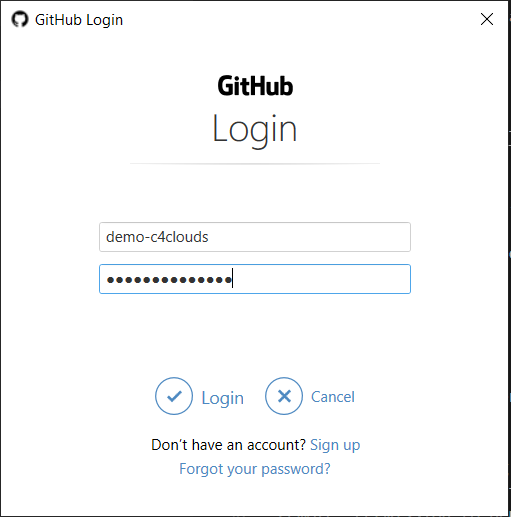
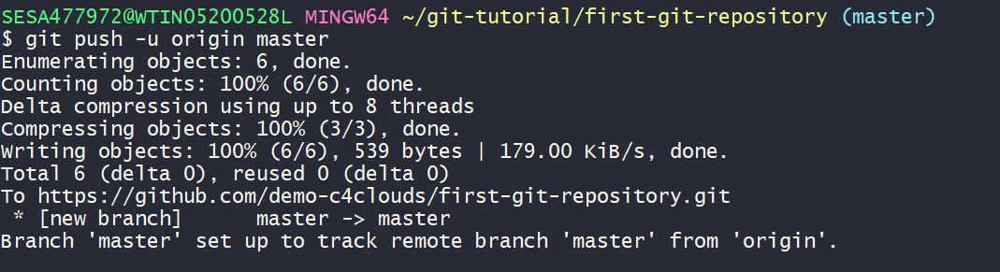
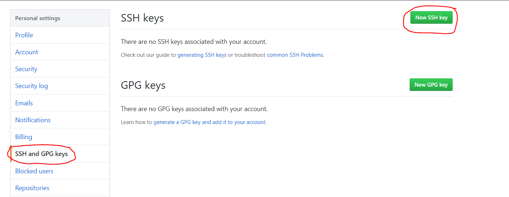
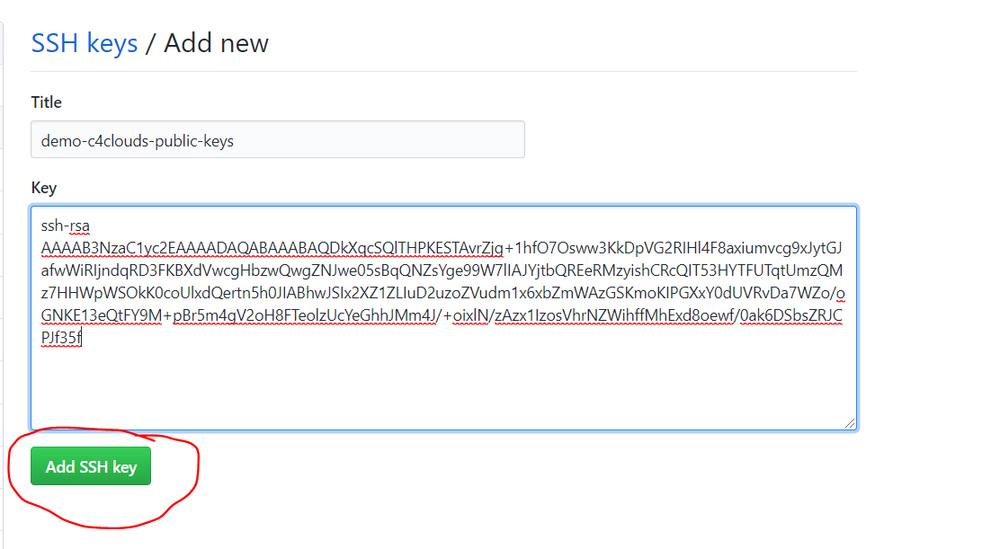
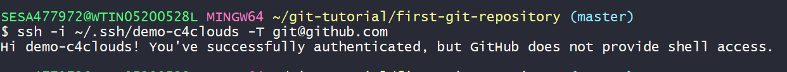

## Create Free GitHub Account

[Click Here to Create a Free GitHub Account](https://github.com/join)

Provide necessary information to create an Account


### To connect the local to remote repository over  HTTPS 

```bash
git remote add origin https://github.com/demo-c4clouds/first-git-repository.git
```


To verify the Remote Repository
```bash
git remote -v
```
Push to remote
```bash
git push -u origin master
```
```code
Note: If you are getting error
$ git push -u origin master
remote: Permission to demo-c4clouds/first-git-repository.git denied to some-username.
fatal: unable to access 'https://github.com/demo-c4clouds/first-git-repository.git/': The requested URL returned error: 403

#solution
For Windows you can find the keys here:

control panel > user accounts > credential manager > Windows credentials > Generic credentials

Next remove the Github keys.
```





### To connect the local to remote repository over  SSH
Inorder to connect over SSH we need to genereate the public and private keys


### To Generate SSH Key Pairs
```
ssh-keygen
```

Once you generate the Public and Private keys open the Public key and copy the contents. Navigate to the github account --> settings --> SSH and GPG keys.



Click on New SSH Keys --> Add SSH Key



To Check SSH Keys are working or not?
```code
#ssh -i /path/to/privatekey-file -T git@github.com
ssh -i ~/.ssh/demo-c4clouds -T git@github.com
```



[Click Here to go to git.md](https://github.com/submah/git-tutorial/blob/master/git.md)

