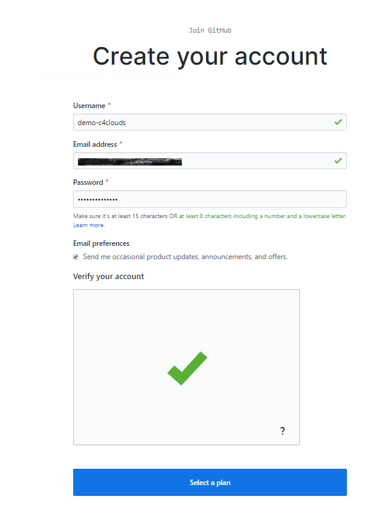
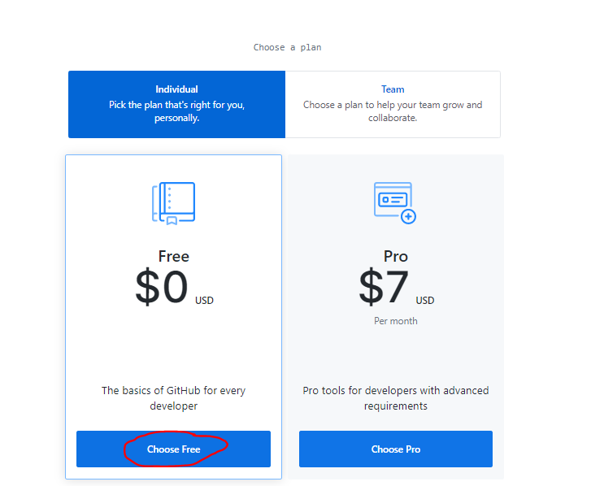
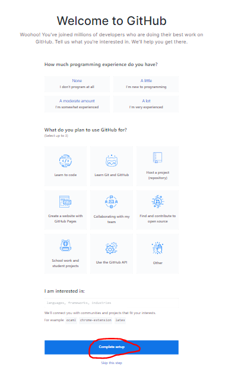
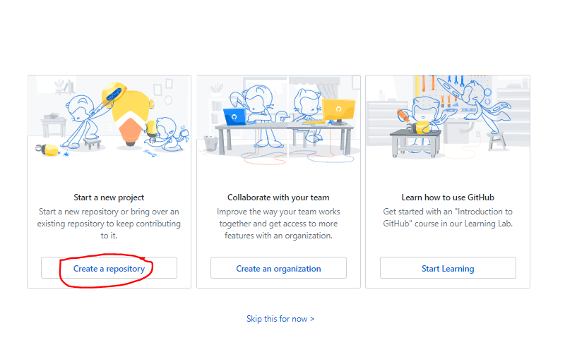
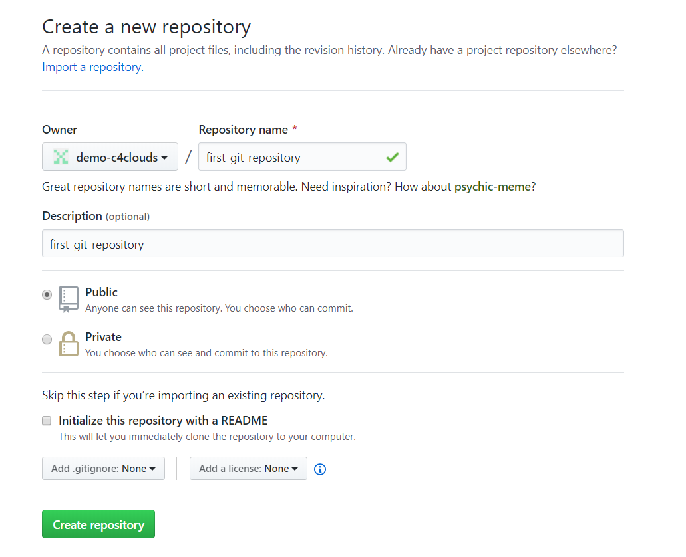
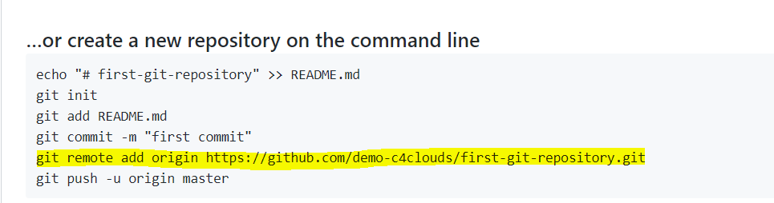

## Create Free GitHub Account

[Click Here to Create a Free GitHub Account](https://github.com/join)

Provide necessary information to create an Account












### To connect the local to remote repository over  HTTPS 

```bash
git remote add origin https://github.com/demo-c4clouds/first-git-repository.git
```



To verify the Remote Repository
```bash
git remote -v
```
Push to remote
```bash
git push -u origin master
```
```code
Note: If you are getting error
$ git push -u origin master
remote: Permission to demo-c4clouds/first-git-repository.git denied to some-username.
fatal: unable to access 'https://github.com/demo-c4clouds/first-git-repository.git/': The requested URL returned error: 403
# Execute the below command
git remote set-url origin https://github.com/demo-c4clouds/first-git-repository.git
```

